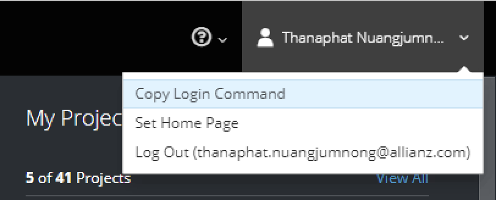

# Objective
We need to migrate all images in the docker registry that running inside the Openshift platform go to the Azure container registry.

# Skopeo-pull-push-images
First, get the name of the image in the private registry and then get that tags of image writing to the image_name.json. Next, using the Skopeo tool push all images in the private registry to the ACR Cloud.

# Install skopeo tool
Please following this link: https://github.com/containers/skopeo/blob/main/install.md

# Preparation
1. Setting Url, User and Token of the docker registry in Python script
```
docker_registry_url = "{your-url-of-registry-source}"
docker_user = "{username}"
docker_token = "{your_token}}"
```

Note: you can get that infomation on the Portal of Openshift


2. Setting URL, User and Access-Key of the ACR.
```
##Parameter

acr_url = "{your-url-of-registry-destination}"
acr_user = "{username}" 
acr_access_key = "{your_key}"
```

# How to run
## Run python script in the screen / tmux because in takes a long time if you have a lot of images.
```
python3 skopeo-pull-push.py
```

# How to retry
The script will loop try to push the name of images in the failed.log
```
python3 skopeo-pull-push_retry.py
```

# Logging stored in...
```
success.log
failed.log
```
Note: this script will be try to push the image 3 times if it failed will store the name of image in the failed.log